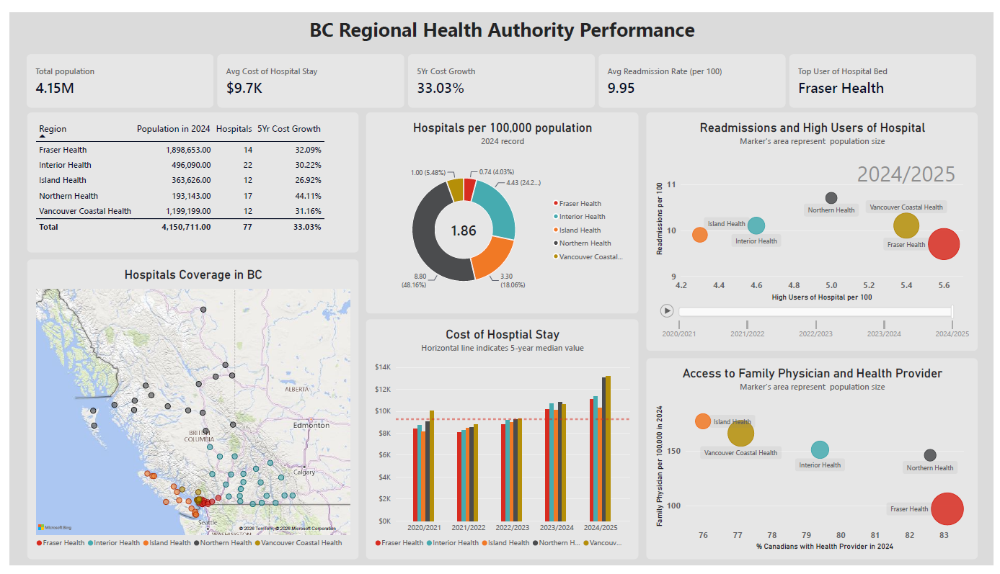

# BC Health Authority Performance Dashboard

An end-to-end **data analytics and business intelligence project** exploring healthcare infrastructure, population coverage, and selected health-system performance indicators across British Columbia's five regional health authorities.

The project combines publicly available healthcare, population, and health-system data using **MySQL for data preparation and transformation** and **Power BI for interactive visualization and analysis**.


---

## 🎥 Dashboard demo


<p align="center">
  
</p>


---

## Installation and reproduction

For set-up, repo-structure, and reproducing this project, see [docs/run-repo.md](docs/run-repo.md)

## 🎯 Project Overview

Healthcare resources and outcomes can vary considerably across regions. This project brings together multiple public datasets to explore how **hospital infrastructure, population, healthcare access, and selected health-system indicators** vary across British Columbia.

The analysis focuses on the five regional health authorities:

* **Fraser Health**
* **Interior Health**
* **Island Health**
* **Northern Health**
* **Vancouver Coastal Health**

The project was designed to answer questions such as:

* How are hospitals distributed across BC's regional health authorities?
* How many hospitals are available relative to the population served?
* How have hospital costs changed over time?
* How do hospital readmission rates vary across regions?
* How does access to regular healthcare providers compare between health authorities?
* How does family physician availability vary across BC?
* What relationships can be observed between healthcare infrastructure, population, and health-system indicators?

The **population** record is based on the year **2024**, while the **health performance indicators** are from a 5 year period between **2020/2021 to 2024/2025**.


## 📊 Dashboard Preview


<p align="center">
  
</p>


---
## 🔍 Major Findings

* Northern Health has the highest hospital coverage, with 8.8 hospitals per 100,000 population, compared with 0.74 in Fraser Health.

* Vancouver Health has the highest hospital stay cost year-over-year. Northern Health recorded the highest five-year growth in hospital-stay costs (44.11%), compared with the overall growth of 33.03%.

* Fraser Health had the highest rate of high users of hospital beds (~5.6 per 100), Northern Health had the highest 2024/25 hospital readmission rate (~10.7 per 100).

* Island Health had the highest family-physician density (~175 per 100,000), while Fraser Health reported the highest share of people with a regular healthcare provider (~84%).

* Fraser Health serves the largest population (1.90M) with 14 hospitals, while Interior Health has the most hospitals (22) serving about 496,000 people, highlighting substantial regional differences in healthcare infrastructure.

> These findings reflect the datasets and reporting periods used in the project. Hospital counts and hospital-to-population ratios should not be interpreted as direct measures of healthcare quality or accessibility.

---


## 🔄 Data Pipeline

The project follows an end-to-end data analytics workflow:

```text
Public Data Sources
       │
       ▼
Data Collection
       │
       ▼
Data Cleaning & Validation
       │
       ▼
City / Health Authority Mapping
       │
       ▼
Population Matching
       │
       ▼
MySQL Analytical Tables
       │
       ▼
Power BI Data Model
       │
       ▼
Interactive Dashboard
```

### Data Preparation

The SQL workflow performs several transformations, including:

1. Importing raw hospital data into MySQL
2. Cleaning hospital records
3. Filtering organizations outside the five regional health authorities
4. Mapping cities to health authorities
5. Matching municipal population data to hospital locations
6. Resolving differences in city naming between datasets
7. Cleaning and converting health-indicator metrics to numeric values
8. Preparing analytical tables for Power BI

---


## ⚠️ Important Considerations

### Different reporting periods

The indicators use different time scales, including calendar years and fiscal years. These periods should not be treated as interchangeable.

### Population matching

Population estimates are available at the municipal level and do not necessarily represent hospital catchment populations.

### Missing population records

Some hospital locations do not have corresponding municipal population records in the selected dataset. These cases are handled explicitly rather than assigning unsupported population estimates.

### Descriptive analysis

The dashboard is intended for **exploratory and descriptive analysis**. Differences between health authorities should not automatically be interpreted as causal relationships.

### Data freshness

The project uses public datasets that may be updated by their respective organizations. The results therefore represent the data available when the project was created or last refreshed.

---

## 🔮 Future Improvements

Potential extensions include:

* Automating data ingestion from public APIs and open-data portals
* Adding BC health-authority boundary shapefiles
* Adding hospital travel-time and accessibility analysis
* Incorporating population density
* Adding additional CIHI indicators
* Building automated data-quality checks
* Adding historical population trends
* Developing a fully automated ETL pipeline
* Deploying the dashboard through Power BI Service

---

## 📚 Data Sources

* [Canadian Institute for Health Information](https://www.cihi.ca/)
* [Government of Canada Open Data](https://open.canada.ca/)
* [Government of British Columbia](https://www2.gov.bc.ca/)
* [Doctors of BC](https://www.doctorsofbc.ca/)

Learn more about the data sources and retrieval here: [docs/data-sources.md](docs/data-sources.md)

---

## 👤 Author

**Obinna Uzoh**

[GitHub](https://github.com/ObinnaUzoh)

---

## ⭐ If You Find This Project Useful

If you find the project useful or interesting, consider giving the repository a ⭐ on GitHub.

Contributions, suggestions, and discussions are welcome.

